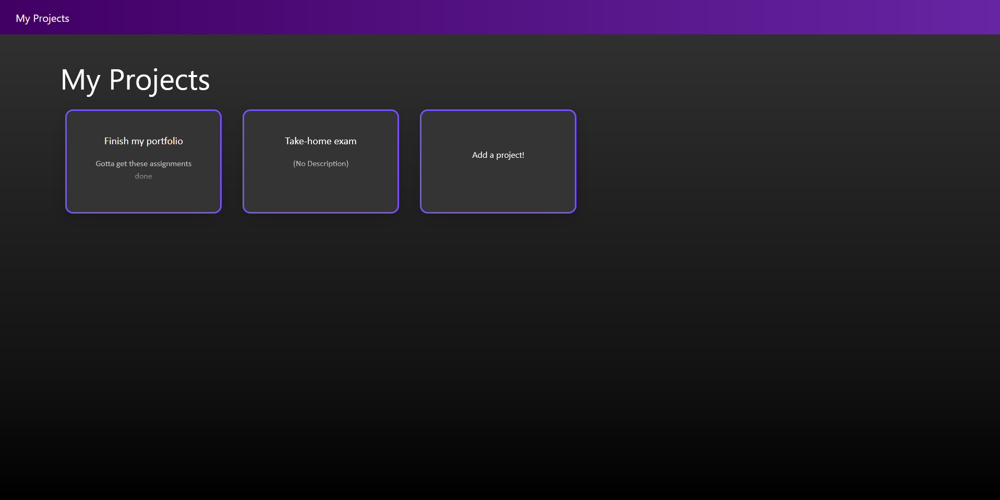

# Pigeon

Pigeon is a web application built in Spring & React, intended to be used with Postgres. It's a project manager intended to be more streamlined than more mainstream products like Clickup or Trello.

You can create project entries under a user account, navigate into them, and create tasks, with assigned metadata like priority or due dates. You can then mark those tasks as complete or delete them.

The database is stored on my computer so it'll be tricky to use without building one yourself, but just ask me if you want me to send you a backup of my schema. Reach me at 01mk.lent@gmail.com.
